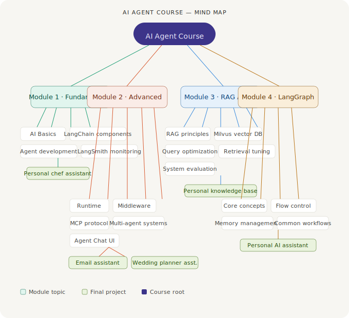

# AI Agent Course — Mind Map



## Tech Stack

| Module | Key Technologies | Level |
|--------|-----------------|-------|
| Fundamentals | LangChain · LangSmith | ★ Beginner |
| Advanced Agent | MCP · Multi-Agent · Runtime | ★★ Intermediate |
| RAG Agent | Milvus · Vector Search · Evaluation | ★★ Intermediate |
| LangGraph | State Graph · Workflow Orchestration | ★★★ Advanced |

## Learning Path

```
Fundamentals → Engineering → Knowledge Retrieval → Workflow Orchestration → Full Project
```

## Projects

| Project | Module | Description |
|---------|--------|-------------|
| Personal Chef Assistant | Fundamentals | Tool-calling Agent |
| Email Assistant | Advanced Agent | Multi-Agent workflow |
| Wedding Planner Assistant | Advanced Agent | Business scenario Agent |
| Personal Knowledge Base | RAG Agent | Vector retrieval system |
| Personal AI Assistant | LangGraph | Full stateful Agent |
